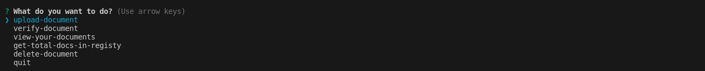

# DOCUMENT-REGISTRY ICP CLI


This is a node js application that helps users verify documents that have been issued by an organization.

The application uses the encryption methods sha256 and ICP encode to produce a distinct key that is identifiable to that single issued document.

## Canister Parameters

- Users have the ability to add documents to the contract and they can also delete the documents they added.
- Other users can verify if a document already exists on the registry.

## Use Cases

1. This Dapp can be used by document issuing organizations, like schools, business, e.t.c.
2. It can be used to ensure validity of a perticular document, and help reduce the effect of forgery in the professional world.

## Development

The project runs on node js and [AZLE](https://demergent-labs.github.io/azle/the_azle_book.html). To test:

- clone the repo

```
git clone https://github.com/Tamara-Ebi-Pere-Victor/Doc-Reg-CLI.git
```

- cd to server directory and install the dependencies

```
npm install
```

- then run the following commands to start the icp canister.

```
    dfx start --background --clean
    dfx deploy
```

- cd to the app directory and and install the dependencies 

```
npm install
```

- create a `.env` file with the following parameters

```
APP_CANISTER_ID=
APP_USER_ID=
```

- Then run the command to start the node js application.
```
npm start
```

N/B: there are files in the examples folder that you can use to test. `./examples/<file name>`

### Commands Available

