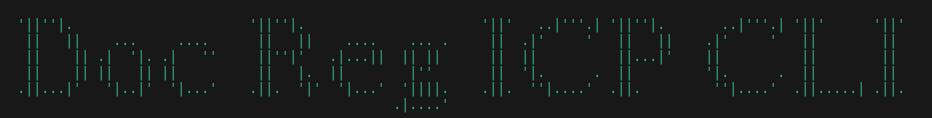

# DOCUMENT-REGISTRY ICP CLI



This is a node js application that helps users verify documents that have been issued by an organization.

The application uses the encryption methods sha256 and ICP encode to produce a distinct key that is identifiable to that single issued document.

## Canister Parameters

- Users have the ability to add documents to the contract and they can also delete the documents they added, provided they've opted in to the contract.
- To add a document, user has to pay a fee of 1 algo.
- To verify a document, user has to pay a fee of 0.1 algo

## Use Cases

1. This Dapp can be used by document issuing organizations, like schools, business, e.t.c.
2. It can be used to ensure validity of a perticular document, and help reduce the effect of forgery in the professional world.

## Development

The project runs on node js and utilizes the azle typescript program.

- git clone repo
- cd to server directory and run the following commands to start the icp canister.

```
    dfx start --background --clean
    dfx deploy
```

- cd to the app directory and start the node js application to use.
- there are files in the examples folder that you can use to test. `./examples/<file name>`

```
npm start
```

### Commands Available


